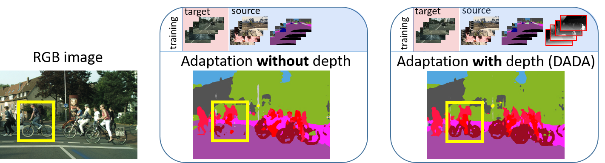

# DADA: Depth-aware Domain Adaptation in Semantic Segmentation

## Updates
- *02/2020*: Using CycleGAN translated images, The DADA model achieves (**43.1%**) on SYNTHIA-2-Cityscapes

## Paper


[DADA: Depth-aware Domain Adaptation in Semantic Segmentation](https://arxiv.org/abs/1904.01886)  
 [Tuan-Hung Vu](https://tuanhungvu.github.io/),  [Himalaya Jain](https://himalayajain.github.io/), [Maxime Bucher](https://maximebucher.github.io/), [Matthieu Cord](http://webia.lip6.fr/~cord/), [Patrick Pérez](https://ptrckprz.github.io/)  
 valeo.ai, France  
 IEEE International Conference on Computer Vision (ICCV), 2019

If you find this code useful for your research, please cite our [paper](https://arxiv.org/abs/1904.01886):

```
@inproceedings{vu2019dada,
  title={DADA: Depth-aware Domain Adaptation in Semantic Segmentation},
  author={Vu, Tuan-Hung and Jain, Himalaya and Bucher, Maxime and Cord, Mathieu and P{\'e}rez, Patrick},
  booktitle={ICCV},
  year={2019}
}
```

## Abstract
Unsupervised domain adaptation (UDA) is important for applications where large scale annotation of representative data is challenging. For semantic segmentation in particular, it helps deploy on real "target domain" data models that are trained on annotated images from a different "source domain", notably a virtual environment. To this end, most previous works consider semantic segmentation as the only mode of supervision for source domain data, while ignoring other, possibly available, information like depth. In this work, we aim at exploiting at best such a privileged information while training the UDA model. We propose a unified depth-aware UDA framework that leverages in several complementary ways the knowledge of dense depth in the source domain. As a result, the performance of the trained semantic segmentation model on the target domain is boosted. Our novel approach indeed achieves state-of-the-art performance on different challenging synthetic-2-real benchmarks.

## Preparation

### Pre-requisites
* Python 3.7
* Pytorch >= 1.2.0
* CUDA 10.0 or higher
* The latest version of the [ADVENT](https://github.com/valeoai/ADVENT) code.

### Installation

0. Install OpenCV if you don't already have it:

```bash
$ conda install -c menpo opencv
```

1. Install ADVENT, the latest version:
```bash
$ git clone https://github.com/valeoai/ADVENT.git
$ pip install -e ./ADVENT
```

2. Clone and install the repo:
```bash
$ git clone https://github.com/valeoai/DADA
$ pip install -e ./DADA
```

With this (the `-e` option of pip), you can edit the DADA code on the fly and import function 
and classes of DADA in other project as well.

3. Optional. To uninstall this package, run:
```bash
$ pip uninstall DADA
```

You can take a look at the [Dockerfile](./Dockerfile) if you are uncertain about steps to install this project.

### Datasets
  By default, the datasets are put in ```DADA/data```. We use symlinks to hook the DADA codebase to the datasets. An alternative option is to explicitlly specify the parameters ```DATA_DIRECTORY_SOURCE``` and ```DATA_DIRECTORY_TARGET``` in YML configuration files.

* **SYNTHIA**: Please first follow the instructions [here](http://synthia-dataset.net/downloads/) to download the images. In this work, we used the *SYNTHIA-RAND-CITYSCAPES (CVPR16)* split. The segmentation labels can be found [here](https://github.com/valeoai/DADA/releases). The dataset directory should have this basic structure:
  ```bash
  DADA/data/SYNTHIA                           % SYNTHIA dataset root
  ├── RGB
  ├── parsed_LABELS
  └── Depth
  ```

* **Cityscapes**: Please follow the instructions in [Cityscape](https://www.cityscapes-dataset.com/) to download the images and validation ground-truths. The Cityscapes dataset directory should have this basic structure:
  ```bash
  DADA/data/Cityscapes                       % Cityscapes dataset root
  ├── leftImg8bit
  │   ├── train
  │   └── val
  └── gtFine
      └── val
  ```

* **Mapillary**: Please follow the instructions in [Mapillary](https://www.mapillary.com/dataset) to download the images and validation ground-truths. The Mapillary dataset directory should have this basic structure:
  ```bash
  DADA/data/mapillary                        % Mapillary dataset root
  ├── train
  │   └── images
  └── validation
      ├── images
      └── labels
  ```

### Pre-trained models
Pre-trained models can be downloaded [here](https://github.com/valeoai/DADA/releases) and put in ```DADA/pretrained_models```

## Running the code
For evaluating pretrained networks, execute:
```bash
$ cd DADA/dada/scripts
$ python test.py --cfg ./<configs_dir>/dada_pretrained.yml
$ python test.py --cfg ./<configs_dir>/dada_cyclegan_pretrained.yml
```

```<configs_dir>``` could be set as ```configs_s2c``` (```SYNTHIA2Cityscapes```) or ```configs_s2m``` (```SYNTHIA2Mapillary```)

### Training
For the experiments done in the paper, we used pytorch 1.2.0 and CUDA 10.0. To ensure reproduction, the random seed has been fixed in the code. Still, you may need to train a few times or to train longer (by changing ```MAX_ITERS``` and ```EARLY_STOP```) to reach the comparable performance.

By default, logs and snapshots are stored in ```DADA/experiments``` with this structure:
  ```bash
  DADA/experiments
  ├── logs
  └── snapshots
  ```

To train DADA:
```bash
$ cd DADA/dada/scripts
$ python train.py --cfg ./<configs_dir>/dada.yml
$ python train.py --cfg ./<configs_dir>/dada.yml --tensorboard         % using tensorboard
```

To train AdvEnt baseline:
```bash
$ cd DADA/dada/scripts
$ python train.py --cfg ./<configs_dir>/advent.yml
$ python train.py --cfg ./<configs_dir>/advent.yml --tensorboard         % using tensorboard
```

### Testing
To test DADA:
```bash
$ cd DADA/dada/scripts
$ python test.py --cfg ./<configs_dir>/dada.yml
```

## Acknowledgements
This codebase heavily depends on [AdvEnt](https://github.com/valeoai/ADVENT).

## License
DADA is released under the [Apache 2.0 license](./LICENSE).